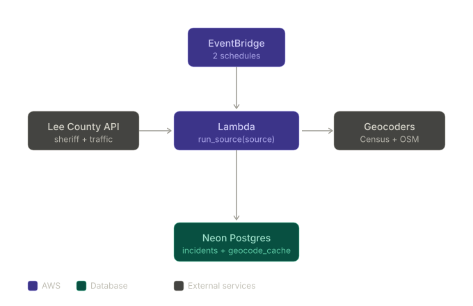

# Lee County Sheriff Activity — Data Pipeline

A resilient, cloud-deployed ingestion pipeline that collects, normalizes, geocodes, and archives public Computer-Aided Dispatch (CAD) data from the Lee County (FL) Sheriff's Office. It is the data-collection backend for an interactive map that visualizes public-safety incidents geographically and over time.

This repository is the **ingestion layer** of a larger UCF Senior Design project. It runs autonomously in the cloud, accumulating a clean, geocoded, queryable history of sheriff incidents and traffic crashes that downstream components (an interactive map, heatmaps, DBSCAN clustering, and trend analysis) build on top of.

---

## What it does

The pipeline separates **harvesting** (pulling raw records and storing them) from **geocoding** (resolving addresses to coordinates), so the slow, rate-limited geocoders never block data collection. Both stages are idempotent and resumable.

**Harvest** — for each record:

1. **Fetch** public CAD records from a Lee County API.
2. **Normalize** each record into a single canonical schema, regardless of the source's quirks.
3. **Store** idempotently — new records inserted, existing ones deduplicated on `(source, source_incident_id)`, live `status` changes updated in place. Coordinates are left null at this stage.

**Geocode** — a separate pass drains rows that still lack coordinates, resolving each address through a three-tier fallback strategy with a persistent cache, and backfilling the coordinates in place.

There are two ways data enters the system:

- **Live incremental feeds** (cloud, continuous) — two feeds on independent schedules:
  - **Sheriff incidents** — the general CAD feed (disturbances, thefts, animal calls, etc.). The API returns only the most recent ~1,000 records (≈ two weeks of activity), so this runs every 12 hours.
  - **Traffic crashes** — a separate feed that returns only the 5 most recent active calls, so it runs every 5 minutes to avoid missing records as they roll off.
- **Bulk historical backfill** (the crawl, run by collaborators) — a coordinated crawler that reconstructs ~2.5 years of history the live API can't paginate to, by exploiting the API's substring address filter. See [Bulk historical extraction](#bulk-historical-extraction).

Both paths write to the same `incidents` table under the same `source` (`lee_county`), so history and live data deduplicate into one record set, and a single geocoding pass serves everything.

---

## Architecture



The design is an **engine** (a small reusable library) with **two apps** built on top of it (the live pipeline and the bulk crawl). The engine is built around swappable abstractions, so adding a data source, changing a geocoder, or switching storage backends never requires touching unrelated code.

### Adapters (`adapters/`)

Each data source is a self-contained adapter implementing a common `IncidentSource` interface: `fetch_raw()` (hit the API, return raw records) and `normalize(raw, fetched_at)` (map one raw record to the canonical model). The only code that knows anything source-specific lives in its adapter. Adding a new source — a new county, should one ever publish a public API — is a single new file plus one line in the registry.

### Canonical model (`models.py`)

Every adapter emits a `NormalizedIncident` (a Pydantic model). Downstream code only ever sees this one type, never a source's raw shape. The full original payload is preserved in a `raw` field so no information is lost and new fields can be backfilled later.

### Geocoding (`geocoding/`)

Addresses arrive as free text and must be resolved to coordinates. No single free geocoder handles every case, so the pipeline chains three behind a common interface, trying each in order until one succeeds:

1. **Census Geocoder** — fast and parallel, handles standard street addresses (`535 PINE ISLAND RD`).
2. **Overpass / OpenStreetMap** — resolves *intersections* (`CLAYTON AVE / LEELAND HEIGHTS BLVD E`) by finding the two named roads in OSM and returning the node they physically share. Census cannot do this. Overpass requests rotate across three public endpoints with per-endpoint cooldowns to stay within rate limits.
3. **Nominatim** — a fuzzy last-resort fallback for unusual addresses the first two miss.

A persistent **cache** (keyed on the normalized address) ensures each unique location is geocoded only once, ever. Rate-limited geocoders (Overpass, Nominatim) are throttled to respect their public usage policies. Results are tagged with which geocoder resolved them, so coordinate provenance is queryable.

### Engine wiring (`ingest.py`)

`ingest.py` holds the glue both apps share:

- `build_store()` / `build_geocoding()` — select the storage and cache backend from the `DATABASE_URL` environment variable (unset → SQLite, set → Postgres), so nothing else in the codebase changes between local and cloud.
- `geocode_pending(store, geocoding, worker_id, limit)` — the single geocoding pass: claim a batch of un-geocoded rows, resolve them in parallel (Census parallelizes; Overpass/Nominatim self-throttle), and write coordinates back. A miss bumps a per-row attempt counter; after 3 misses the row is left as permanently un-geocodable so it isn't retried forever. Used by the live geocode Lambda, the crawl's `geocode` command, and the local backfill script alike.

### Live pipeline (`pipeline/`)

`pipeline/runner.py`'s `run_source(name)` is the **harvest** path for the live feeds — resolve the adapter, fetch, normalize, upsert (no geocoding). `pipeline/lambda_handler.py` is the cloud entry point; it dispatches on the event payload, running a harvest for `{"source": ...}` or a geocode pass for `{"action": "geocode"}`.

### Bulk crawl (`crawl/` + `crawl_runner.py`)

The coordinated historical backfill — see [Bulk historical extraction](#bulk-historical-extraction).

### Storage (`store/`)

A common `IncidentStore` interface with two implementations:

- **`SqliteStore`** — zero-setup local development; the database is a single file under `data/`.
- **`PostgresStore`** — production storage on Neon, with `ON CONFLICT` upserts for efficient batch writes.

Upserts are idempotent and dedup on `(source, source_incident_id)`. They backfill coordinates only when a stored record previously lacked them, and update a record's live `status` when it changes. The store also exposes the geocode-pass primitives: `claim_ungeocoded` (lease a batch), `mark_geocoded`, and `mark_geocode_attempt`.

---

## Project structure

```
.
├── adapters/                   # engine: data sources
│   ├── base.py                 # IncidentSource interface + shared HTTP helpers
│   ├── lee_county.py           # Sheriff incidents adapter (+ fetch_by_address for the crawl)
│   └── lee_county_traffic.py   # Traffic crashes adapter
├── geocoding/                  # engine: geocoders + cache
│   ├── base.py                 # Geocoder + GeocodeCache interfaces
│   ├── census.py               # Census Geocoder (standard addresses)
│   ├── overpass.py             # OpenStreetMap intersection geocoder (3-endpoint rotation)
│   ├── nominatim.py            # Fuzzy fallback geocoder
│   ├── composite.py            # Chains geocoders; first hit wins
│   ├── postgres_cache.py       # PostgresCache
│   ├── sqlite_cache.py         # SqliteCache
│   └── service.py              # Cache-then-geocode service
├── store/                      # engine: persistence
│   ├── base.py                 # IncidentStore interface
│   ├── sqlite.py               # Local file-based storage
│   └── postgres.py             # Neon / production storage
├── pipeline/                   # APP 1 — live incremental feeds
│   ├── runner.py               # run_source(): harvest one feed
│   └── lambda_handler.py       # AWS Lambda entry (harvest | geocode dispatch)
├── crawl/                      # APP 2 — bulk historical extraction
│   ├── coordinator.py          # crawl_queries schema + claim / fan-out / finish
│   └── worker.py               # harvest worker loop (claim → fetch → fan out, self-paced)
├── crawl_runner.py             # crawl entry point (init | work | geocode | test)
├── scripts/
│   ├── backfill_geocode.py     # One-shot geocode pass over un-geocoded rows
│   ├── migrate_to_postgres.py  # One-time SQLite → Neon migration
│   └── smoke.py                # Initial end-to-end sanity check
├── tests/
│   ├── test_lee_county.py      # Adapter normalization tests
│   └── fixtures/
│       └── lee_county_sample.json
├── data/                       # Local SQLite DBs (git-ignored)
├── ingest.py                   # engine wiring: build_store/build_geocoding/geocode_pending
├── models.py                   # NormalizedIncident canonical schema
├── paths.py                    # CWD-independent path anchoring
├── street_queries.txt          # crawl seed: ~13k Lee County street names (git-ignored)
├── pyproject.toml              # Source of truth for dependencies
├── uv.lock
└── README.md
```

---

## Data model

Each record is stored with the following fields:

| Field | Description |
|---|---|
| `source` | Which feed it came from (e.g. `lee_county`, `lee_county_traffic`) |
| `source_incident_id` | The source's own incident/call identifier |
| `occurred_at` | When the incident happened (stored in UTC) |
| `fetched_at` | When the pipeline retrieved it (UTC) |
| `lat`, `lon` | Coordinates (null if unresolved) |
| `nature` | Call type, e.g. `CRASH`, `DISTURBANCE`, `SHOTS FIRED` |
| `disposition` | Outcome, where provided |
| `address`, `city` | Reported location |
| `geocoded_at` | When coordinates were derived (null = coords came from the source) |
| `geocode_quality` | Which geocoder resolved it and its confidence |
| `geocode_attempts` | Failed geocode passes; the geocoder stops retrying a row after 3 |
| `geocode_locked_by` | Worker that holds (or last held) the row's geocode lease — doubles as resolver attribution |
| `geocode_locked_at` | When the lease was taken; leases older than 15 min are reclaimable |
| `status` | Live dispatch status, e.g. `ASSIGNED`, `ARRIVED` (traffic feed) |
| `raw` | The complete original payload |

`(source, source_incident_id)` is the primary key. Indexes support time-range and geographic queries.

---

## Running locally

Requires [uv](https://github.com/astral-sh/uv) and Python 3.12+.

```bash
# Install dependencies
uv sync

# Harvest a single live feed (writes to a local SQLite DB under data/ when DATABASE_URL is unset)
uv run python -m pipeline.runner lee_county
uv run python -m pipeline.runner lee_county_traffic

# Run against Postgres instead — just set the connection string
DATABASE_URL="postgresql://..." uv run python -m pipeline.runner lee_county

# Geocode whatever is still missing coordinates
uv run python scripts/backfill_geocode.py 150

# Run the tests
uv run pytest
```

---

## Bulk historical extraction

The live API only exposes the most recent ~1,000 records with no pagination, so deep history is unreachable through normal querying. The crawl recovers it by exploiting the API's one filter — `address`, a literal **substring** match.

**The strategy.** US addresses follow `<house number> <street> <suffix>`. Because the match is a literal substring, `address=0 PALM BEACH BLVD` matches only incidents whose house number ends in `0` (the space is literal). The ten queries `0 PALM BEACH BLVD` … `9 PALM BEACH BLVD` form a disjoint partition of every numbered address on that street, and the split is recursive: if a query still returns the 1,000-record cap, it fans out into ten more-specific children (`00 …`, `10 …`, … `90 …`). Seeding from ~13,000 Lee County street names and recursing only where needed reconstructs the full history.

**Coordination.** A `crawl_queries` table on Neon is the shared work queue. Workers — collaborators each running on their own home connection, each respecting the published per-IP rate limit — atomically claim a pending query (`FOR UPDATE SKIP LOCKED`), fetch it, write any results, and on a truncated (1,000-record) result fan out ten children back into the queue. The claim is **self-healing**: it also picks up queries left `in_progress` by a worker that crashed, so no separate reaper is needed. Harvesting only writes raw records; geocoding is a separate `geocode` pass that drains un-geocoded rows, coordinated across workers by a 15-minute **row lease** (`geocode_locked_by` / `geocode_locked_at`) so collaborators don't redo each other's work.

**Rate discipline.** The binding limit is ~50 requests per IP per 12 hours, so each worker self-paces to one request every ~15 minutes (≈4/hour, ≈48 per 12h). Throughput scales by adding collaborators, not by going faster; a full crawl is a multi-week effort.

**Running it** (set `DATABASE_URL` to the shared Neon connection string):

```bash
# Once, by whoever seeds the queue (needs street_queries.txt locally):
uv run python crawl_runner.py init             # creates schema + seeds the full street list
uv run python crawl_runner.py init my_seed.txt # ...or seed a custom subset

# Each collaborator, on their own machine/IP:
uv run python crawl_runner.py work  <worker_id>    # harvest: claim → fetch → fan out, self-paced
uv run python crawl_runner.py geocode <worker_id>  # geocode: drain un-geocoded rows, then exit

# Quick validation against a small seed before committing to a full run:
uv run python crawl_runner.py test  <worker_id>    # capped, faster-paced harvest
```

The same `geocode_pending` runs in the cloud as a Lambda action, so live and historical data share one geocoding path and one cache.

---

## Deployment

The live pipeline runs serverlessly:

- **Compute** — a single AWS Lambda function (`pipeline.lambda_handler.handler`) that dispatches on its event payload. The same function serves every feed and the geocode pass.
- **Scheduling** — three Amazon EventBridge schedules:
  - `{"source": "lee_county"}` every 12 hours (harvest sheriff incidents)
  - `{"source": "lee_county_traffic"}` every 5 minutes (harvest traffic crashes)
  - `{"action": "geocode", "limit": 100}` every few minutes (resolve a bounded batch of un-geocoded rows)
- **Storage** — a Neon (serverless Postgres) database holds the `incidents`, `geocode_cache`, and `crawl_queries` tables. The Lambda connects via Neon's pooled connection string, set as the `DATABASE_URL` environment variable.

Deployment artifact is a `.zip` built with Linux-targeted wheels so the compiled dependencies (`psycopg`, `pydantic-core`) run on Lambda's runtime:

```bash
uv pip install --python-platform x86_64-manylinux2014 --python-version 3.12 \
  --target build/package --only-binary :all: -r requirements.txt
cp -r adapters geocoding store pipeline build/package/
cp models.py paths.py ingest.py config.py build/package/
cd build/package && zip -rq ../lambda.zip . && cd ../..
```

---

## Data sources & design principles

All data is sourced exclusively from **official public APIs**. The Lee County Sheriff's Office publishes a public incidents API and a public active-traffic-calls endpoint; this pipeline consumes only those. No scraping of non-API sources is performed — a deliberate constraint that keeps the project on firm ethical and legal footing and reflects the broader goal of encouraging agencies to publish open data. The bulk crawl uses the same public incidents API and self-rate-limits below the published per-IP caps.

Lee County is currently the only Florida county with a suitable public API. The adapter architecture is built so that additional counties can be added trivially **if and when** they publish public endpoints — the limiting factor is data availability, not code.

All incident data is public record under Florida's Sunshine Laws (Chapter 119, Florida Statutes).

## Known limitations

- A small, roughly constant set of addresses (highway mile markers, corrupted CAD entries, named landmarks) cannot be resolved by any free geocoder and are stored without coordinates. This is an inherent ceiling of free geocoding, not a defect — geocoded coverage sits in the mid-90% range, which is more than sufficient for density-based visualization and clustering.
- Records with a missing or ambiguous `city` whose street name also exists elsewhere in Florida (e.g. a `PALM BEACH BLVD` on both coasts) can geocode to the wrong location. These are filtered against the Lee County bounding box during downstream data cleaning rather than at ingest time.
- The bulk crawl's digit-partition recovers numbered addresses; intersection and other non-numbered records on a truncated street that fall outside its most-recent 1,000 results are not recovered. Intersections are rare in the incident feed (they dominate the separate traffic feed), so this gap is minor for v1.
- The crawl's ~250-request-per-2-day rate ceiling is an empirical estimate; it should be monitored for `429`s during the first sustained run.

## Acknowledgments

Geocoding is powered by the [U.S. Census Geocoder](https://geocoding.geo.census.gov/), [OpenStreetMap](https://www.openstreetmap.org/) via the [Overpass API](https://overpass-api.de/), and [Nominatim](https://nominatim.org/). Built as part of a Senior Design capstone at the University of Central Florida.

## License

[MIT](LICENSE)