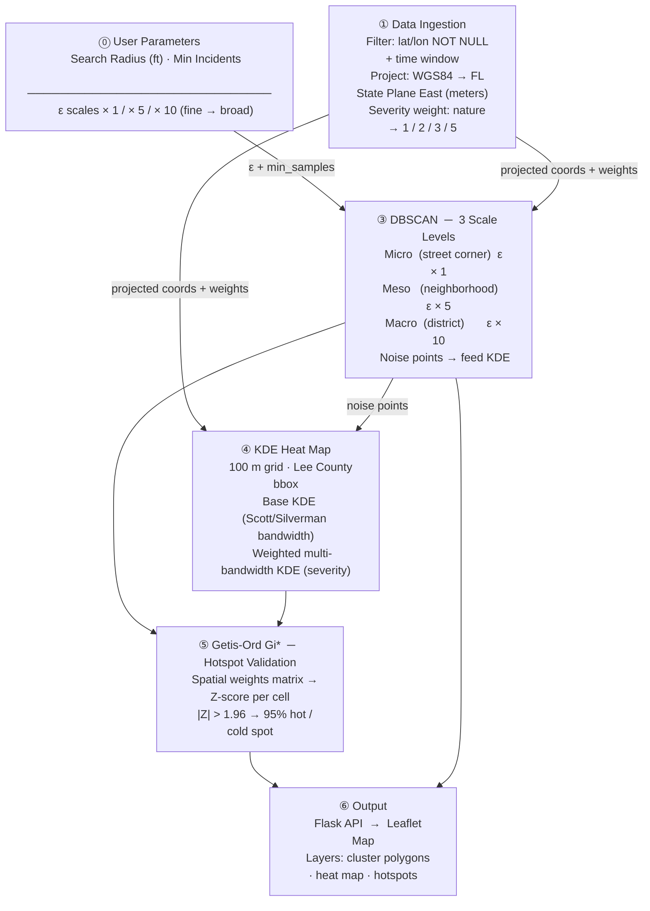

```mermaid
flowchart TD
    PARAMS["⓪ User Parameters
    Search Radius (ft) · Min Incidents
    ──────────────────────────────
    ε scales × 1 / × 5 / × 10 (fine → broad)"]

    INGEST["① Data Ingestion
    Filter: lat/lon NOT NULL + time window
    Project: WGS84 → FL State Plane East (meters)
    Severity weight: nature → 1 / 2 / 3 / 5"]

    DBSCAN["③ DBSCAN  ─  3 Scale Levels
    Micro  (street corner)  ε × 1
    Meso   (neighborhood)   ε × 5
    Macro  (district)       ε × 10
    Noise points → feed KDE"]

    KDE["④ KDE Heat Map
    100 m grid · Lee County bbox
    Base KDE  (Scott/Silverman bandwidth)
    Weighted multi-bandwidth KDE (severity)"]

    GI["⑤ Getis-Ord Gi*  ─  Hotspot Validation
    Spatial weights matrix → Z-score per cell
    |Z| > 1.96 → 95% hot / cold spot"]

    OUT["⑥ Output
    Flask API  →  Leaflet Map
    Layers: cluster polygons · heat map · hotspots"]

    PARAMS -->|ε + min_samples| DBSCAN
    INGEST -->|projected coords + weights| DBSCAN
    INGEST -->|projected coords + weights| KDE
    DBSCAN -->|noise points| KDE
    DBSCAN --> GI
    KDE --> GI
    GI --> OUT
    DBSCAN --> OUT
```
