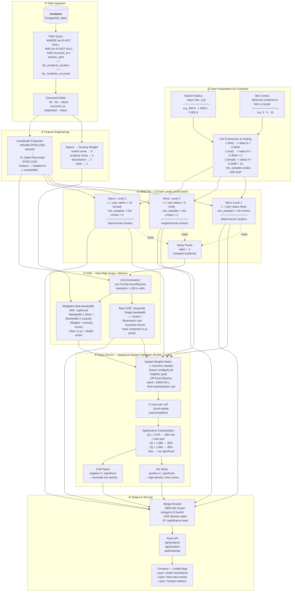

```mermaid
flowchart TD
    subgraph USER_PARAMS["⓪ User Parameters  (UI Controls)"]
        EPS_FT["Search Radius
        Input: feet  🇺🇸
        ──────────────
        e.g. 300 ft · 1 500 ft · 5 000 ft"]
        MIN_C["Min Crimes
        Minimum incidents to form a cluster
        ──────────────
        e.g. 3 · 5 · 10"]
        CONV["Unit Conversion & Scaling
        ε (fine)   = radius ft × 0.3048
        ε (mid)    = radius ft × 0.3048 × 5
        ε (broad)  = radius ft × 0.3048 × 10
        min_samples scales with level"]
        EPS_FT --> CONV
        MIN_C --> CONV
    end

    subgraph INGEST["① Data Ingestion"]
        DB[("`**incidents**
        PostgreSQL table`")]
        FILTER["Filter Query
        WHERE lat IS NOT NULL
        AND lon IS NOT NULL
        AND occurred_at ≥ window_start
        ── idx_incidents_location
        ── idx_incidents_occurred"]
        FIELDS["Extracted Fields
        lat · lon · nature
        occurred_at · disposition · status"]
        DB --> FILTER --> FIELDS
    end

    subgraph FEAT["② Feature Engineering"]
        SEV["Nature → Severity Weight
        violent crime → 5
        property crime → 3
        disturbance → 2
        other → 1"]
        PROJ["Coordinate Projection
        WGS84 EPSG:4326 (stored)
        ↓
        FL State Plane East EPSG:2236
        (meters — needed for ε, bandwidth)"]
        FIELDS --> SEV
        FIELDS --> PROJ
    end

    subgraph DBSCAN_STAGE["③ DBSCAN  ─  3 Scale Levels  (scikit-learn)"]
        direction LR
        D1["Micro  Level 1
        ε = user radius (fine)
        min_samples = min crimes
        ──────────────
        street-corner clusters"]
        D2["Meso  Level 2
        ε = user radius × 5 (mid)
        min_samples = min crimes × 2
        ──────────────
        neighborhood clusters"]
        D3["Macro  Level 3
        ε = user radius × 10 (broad)
        min_samples = min crimes × 3
        ──────────────
        district-level clusters"]
        NOISE["Noise Points
        label = -1
        (isolated incidents)"]
        D1 -. noise .-> NOISE
        D2 -. noise .-> NOISE
        D3 -. noise .-> NOISE
    end

    subgraph KDE_STAGE["④ KDE  ─  Heat Map  (scipy / sklearn)"]
        GRID["Grid Generation
        Lee County bounding box
        resolution ≈ 100 m cells"]
        BASE["Base KDE  (required)
        Single bandwidth
        ── Scott's / Silverman's rule
        Gaussian kernel
        Input: projected (x,y) points"]
        WKDE["Weighted Multi-bandwidth KDE  (optional)
        Bandwidth 1 (fine) + Bandwidth 2 (coarse)
        Weights = severity scores
        Input: (x,y) + weight vector"]
        GRID --> BASE
        GRID --> WKDE
    end

    subgraph GI["⑤ Getis-Ord Gi*  ─  Statistical Hotspot Validation  (PySAL / esda)"]
        WM["Spatial Weights Matrix
        ⚠ Decision needed:
        Queen contiguity (8-neighbor grid)
        OR fixed distance band ≈ DBSCAN ε
        Row-standardized: yes"]
        ZSCORE["Z-score per cell
        (local spatial autocorrelation)"]
        SIG["Significance Classification
        |Z| > 2.576 → 99% hot / cold spot
        |Z| > 1.960 → 95%
        |Z| > 1.645 → 90%
        else → not significant"]
        HOT["Hot Spots
        positive Z, significant
        → high-density crime zones"]
        COLD["Cold Spots
        negative Z, significant
        → unusually low activity"]
        WM --> ZSCORE --> SIG
        SIG --> HOT
        SIG --> COLD
    end

    subgraph OUT["⑥ Output & Serving"]
        MERGE["Merge Results
        DBSCAN cluster polygons (3 levels)
        KDE density raster
        Gi* significance layer"]
        API["Flask API
        /api/analysis
        /api/clusters
        /api/heatmap"]
        LEAFLET["Frontend — Leaflet Map
        Layer: cluster boundaries
        Layer: heat map overlay
        Layer: hotspot markers"]
        MERGE --> API --> LEAFLET
    end

    %% Flow connections
    CONV --> D1 & D2 & D3
    PROJ --> D1 & D2 & D3
    PROJ --> GRID
    SEV --> WKDE
    NOISE --> GRID

    BASE --> WM
    WKDE --> WM
    D1 & D2 & D3 --> WM

    HOT & COLD & BASE & D1 & D2 & D3 --> MERGE
```